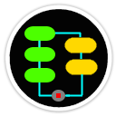

# Welcome to PipeAndFilter
[](https://github.com/FRACerqueira/PipeAndFilter/actions/workflows/build.yml)
[](https://github.com/FRACerqueira/PipeAndFilter/blob/master/LICENSE)
[](https://www.nuget.org/packages/PipeAndFilter/)
[](https://www.nuget.org/packages/PipeAndFilter/)


### **PipeAndFilter component for .NET Core with flexible conditions for each step (pipe) and the ability to parallel execute tasks over a pipe.**

**PipeAndFilter** was developed in C# with the **netstandard2.1**, **.NET 6** and **.NET 7** target frameworks.

**[Visit the official page for more documentation of PipeAndFilter](https://fracerqueira.github.io/PipeAndFilter)**

## Table of Contents

- [What's new - previous versions]()
- [Features](#features)
- [Installing](#installing)
- [Examples](#examples)
- [Usage](#usage)
- [Code of Conduct](#code-of-conduct)
- [Contributing](#contributing)
- [Credits](#credits)
- [License](#license)
- [API Reference](https://fracerqueira.github.io/PipeAndFilter/apis/apis.html)

## What's new in the latest version 
### V1.0.0 

[**Top**](#table-of-contents)

- First Release

## Features
[**Top**](#table-of-contents)

- Contract with thread safety for change values
- Set the maximum amount of parallel execution
- Add multiple preconditions to run a pipe
- Add multiple link to the pipe to jump to another pipe
- Add tasks with a precondition
- Have the detailed status (execution time, execution type, result of each executed condition) in each pipe
- Save a result from each pipe to use when executing another pipe
- Save a result from each task to use during the execution of the aggregation pipe
- Terminate the PipeAndFilter on any task, condition or pipe
- Simple and clear fluent syntax

## Installing
[**Top**](#table-of-contents)

```
Install-Package PipeAndFilter [-pre]
```

```
dotnet add package PipeAndFilter [--prerelease]
```

**_Note:  [-pre]/[--prerelease] usage for pre-release versions_**

## Examples
[**Top**](#table-of-contents)

See folder [**Samples**](https://github.com/FRACerqueira/PipeAndFilter/tree/main/Samples).

```
dotnet run --project [name of sample]
```

## Usage
[**Top**](#table-of-contents)

The **PipeAndFilter** use **fluent interface**; an object-oriented API whose design relies extensively on method chaining. Its goal is to increase code legibility. The term was coined in 2005 by Eric Evans and Martin Fowler.

### Sample-Console Usage

```csharp
var result = await PipeAndFilter.New<MyClass>()
    .AddPipe(ExecPipe1)
        .WithCondition(CondFalse, "LastPipe")
        .WithCondition(CondTrue, null)
        .WithCondition(CondTrue, null)
    .AddPipe(ExecPipe2)
    .AddPipe(ExecPipe3)
    .AddPipeTasks(AgregateTask)
        .WithCondition(CondTrue, null)
        .MaxDegreeProcess(4)
        .AddTask(Task1)
        .AddTaskCondition(Task2, CondFalse)
        .AddTask(Task3)
    .AddPipe(ExecPipe5, "LastPipe")
    .BuildAndCreate()
    .Init(contract)
    .CorrelationId(null)
    .Logger(null)
    .Run();
```

### Sample-api/webUsage
[**Top**](#table-of-contents)

```csharp
builder.Services
    .AddPipeAndFilter(
        PipeAndFilter.New<WeatherForecast>()
            .AddPipe(ExecPipe)
            .Build());

```

```csharp
private static Task ExecPipe(EventPipe<WeatherForecast> pipe, CancellationToken token)
{
    pipe.ChangeContract((contract) =>
    {
        contract.TemperatureC += 10;
    });
    return Task.CompletedTask;
}
```

```csharp
[ApiController]
[Route("[controller]")]
public class WeatherForecastController : ControllerBase
{
    private readonly ILogger<WeatherForecastController> _logger;
    private readonly IPipeAndFilterServiceBuild<WeatherForecast> _mypipe;

    public WeatherForecastController(ILogger<WeatherForecastController> logger, IPipeAndFilterServiceBuild<WeatherForecast> pipeAndFilter)
    {
        _logger = logger;
        _mypipes = pipeAndFilter;
    }

    [HttpGet(Name = "GetWeatherForecast")]
    public async Task<WeatherForecast> Get(CancellationToken cancellation)
    {
            var cid = Guid.NewGuid().ToString();

            var pipe = await _mypipes.First(x => x.ServiceId == "opc1")
                .Create()
                .Logger(_logger)
                .CorrelationId(cid)
                .Init(new WeatherForecast { Date = DateOnly.FromDateTime(DateTime.Now), Summary = "PipeAndFilter-Opc1", TemperatureC = 0 })
                .Run(cancellation);
            return pipe.Result.Value!
    }
}
```


## Code of Conduct
[**Top**](#table-of-contents)

This project has adopted the code of conduct defined by the Contributor Covenant to clarify expected behavior in our community.
For more information see the [Code of Conduct](CODE_OF_CONDUCT.md).

## Contributing

See the [Contributing guide](CONTRIBUTING.md) for developer documentation.

## Credits
[**Top**](#table-of-contents)

**API documentation generated by**

- [xmldoc2md](https://github.com/FRACerqueira/xmldoc2md), Copyright (c) 2022 Charles de Vandière. See [LICENSE](Licenses/LICENSE-xmldoc2md.md).

## License
[**Top**](#table-of-contents)

Copyright 2023 @ Fernando Cerqueira

PipeAndFilter is licensed under the MIT license. See [LICENSE](https://github.com/FRACerqueira/PipeAndFilter/blob/master/LICENSE).

