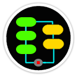
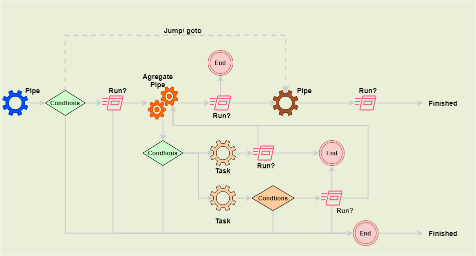

# Welcome to PipeAndFilter
[](https://github.com/FRACerqueira/PipeAndFilter/actions/workflows/build.yml)
[](https://github.com/FRACerqueira/PipeAndFilter/blob/master/LICENSE)
[](https://www.nuget.org/packages/PipeAndFilter/)
[](https://www.nuget.org/packages/PipeAndFilter/)


**PipeAndFilter component for .NET Core with flexible conditions for each step (pipe)
and the ability to parallel execute tasks over a pipe.
.**

**PipeAndFilter** was developed in C# with the **netstandard2.1**, **.NET 6** , **.NET 7** and **.NET 8** target frameworks.

 

## Table of Contents

- [What's new - previous versions](whatsnewprev.md)
- [Features](#features)
- [Installing](#installing)
- [Examples](#examples)
- [Usage](#usage)
- [Performance](#performance)
- [Code of Conduct](#code-of-conduct)
- [Contributing](#contributing)
- [Credits](#credits)
- [License](#license)
- [API Reference](https://fracerqueira.github.io/PipeAndFilter/apis/apis.html)

## What's new in the latest version 
### V1.0.4 
[**Top**](#table-of-contents)

- Release G.A with .NET8 

## Features
[**Top**](#table-of-contents)

- Thread safety to obtain/change contract values ​​and/or generic purpose when running a Task (pararel execute)
- Add multiple pipe
- Add multiple Aggregate pipe (for run pararel tasks)
- Set the maximum amount of parallel execution
- Add multiple preconditions to run a pipe or task
- Add multiple link to the pipe to jump to another pipe
- Perform an action with conditions after pipe/aggregatepipe 
- Have detailed status (execution date, execution time, type of execution, result of each execution) and number of executions in each pipe
- Save multiple results from each pipe to be used during the another pipe/aggregate pipe run
- Save multiple results in each task to be effective during the aggregation pipe run
- Terminate the PipeAndFilter on any task, condition or pipe
- Simple and clear fluent syntax

## Installing
[**Top**](#table-of-contents)

```
Install-Package PipeAndFilter [-pre]
```

```
dotnet add package PipeAndFilter [--prerelease]
```

**_Note:  [-pre]/[--prerelease] usage for pre-release versions_**

## Examples
[**Top**](#table-of-contents)

See folder [**Samples**](https://github.com/FRACerqueira/PipeAndFilter/tree/main/Samples).

```
dotnet run --project [name of sample]
```

## Usage
[**Top**](#table-of-contents)

The **PipeAndFilter** use **fluent interface**; an object-oriented API whose design relies extensively on method chaining. Its goal is to increase code legibility. The term was coined in 2005 by Eric Evans and Martin Fowler.

### Sample-Console Usage (Full features)

```csharp
await PipeAndFilter.New<MyClass>()
    .AddPipe(Pipe1)
        .WithGotoCondition(Cond0, "LastPipe")
        .WithCondition(Cond1)
        .WithCondition(Cond2)
        .AfterRunningPipe(ExecPipeAfter)
            .WithCondition(CondA1)
            .WithGotoCondition(CondA2, "LastPipe")
    .AddPipe(Pipe2)
        .AfterRunningPipe()
            .WithGotoCondition(CondA3, "LastPipe")
    .AddPipe(Pipe3)
        .AfterRunningAggregatePipe(ExecPipeAfterTask)
            .MaxDegreeProcess(8)
            .AddTaskCondition(Task50)
                .WithCondition(CondTrue)
            .AddTask(Task100)    
    .AddPipe(Pipe4)
    .AddAggregatePipe(Pipe5)
        .WithCondition(Cond1)
        .MaxDegreeProcess(4)
        .AddTask(Task50)
        .AddTaskCondition(Task100)
            .WithCondition(Cond3)
            .WithCondition(Cond4)
        .AddTask(Task150)
    .AddPipe(Pipe6, "LastPipe")
    .BuildAndCreate()
    .Init(contract)
    .CorrelationId(null)
    .Logger(null)
    .Run();
```

### Sample-api/webUsage
[**Top**](#table-of-contents)

```csharp
builder.Services
    .AddPipeAndFilter(PipeAndFilter.New<WeatherForecast>()
        .AddPipe(TemperatureAdd10)
        .Build());
```

```csharp
private static Task TemperatureAdd10(EventPipe<WeatherForecast> pipe, CancellationToken token)
{
    pipe.ThreadSafeAccess((contract) =>
    {
        contract.TemperatureC += 10;
    });
    return Task.CompletedTask;
}
```

```csharp
[ApiController]
[Route("[controller]")]
public class WeatherForecastController : ControllerBase
{
    private readonly ILogger<WeatherForecastController> _logger;
    private readonly IPipeAndFilterService<WeatherForecast> _mypipe;

    public WeatherForecastController(ILogger<WeatherForecastController> logger, IPipeAndFilterService<WeatherForecast> pipeAndFilter)
    {
        _logger = logger;
        _mypipes = pipeAndFilter;
    }

    [HttpGet(Name = "GetWeatherForecast")]
    public async Task<WeatherForecast> Get(CancellationToken cancellation)
    {
            var cid = Guid.NewGuid().ToString();

            var pipe = await _mypipes
                .Create()
                .Logger(_logger)
                .CorrelationId(cid)
                .Init(new WeatherForecast { Date = DateOnly.FromDateTime(DateTime.Now), Summary = "PipeAndFilter-Opc1", TemperatureC = 0 })
                .Run(cancellation);
            return pipe.Value!
    }
}
```

## Performance
[**Top**](#table-of-contents)

All pipes, conditions and tasks do not perform any task, they are only called and executed by the component

See folder [**Samples/PipeandFIlterBenchmarking**](https://github.com/FRACerqueira/PipeAndFilter/tree/main/Samples/PipeandFIlterBenchmarking).

```
------------------------------------------------------------------------------------------------------
BenchmarkDotNet v0.13.10, Windows 10 (10.0.19044.3570/21H2/November2021Update)
Intel Core i7-8565U CPU 1.80GHz (Whiskey Lake), 1 CPU, 8 logical and 4 physical cores
.NET SDK 8.0.100-rc.2.23502.2
  [Host]     : .NET 7.0.13 (7.0.1323.51816), X64 RyuJIT AVX2
  DefaultJob : .NET 7.0.13 (7.0.1323.51816), X64 RyuJIT AVX2
------------------------------------------------------------------------------------------------------
| Method                       | Mean      | Error     | StdDev    | Median    | Gen0    | Allocated |
|----------------------------- |----------:|----------:|----------:|----------:|--------:|----------:|
| PipeAsync                    |  3.990 us | 0.0460 us | 0.0384 us |  3.992 us |  0.8698 |   3.57 KB |
| PipeWith10Async              | 97.574 us | 1.7283 us | 1.7748 us | 97.153 us | 15.0146 |  61.37 KB |
| PipeWithConditionAsync       |  5.003 us | 0.0591 us | 0.0524 us |  5.003 us |  1.0834 |   4.45 KB |
| PipeWith10ConditionAsync     | 13.157 us | 0.1262 us | 0.0985 us | 13.155 us |  3.1891 |  13.05 KB |
| PipeWith10ConditionGotoAsync | 18.253 us | 0.3007 us | 0.2347 us | 18.211 us |  3.9978 |  16.34 KB |
| PipeTaskAsync                |  9.741 us | 0.1923 us | 0.3517 us |  9.649 us |  1.3275 |   5.45 KB |
| PipeWith10TaskAsync          | 45.064 us | 0.7313 us | 0.8981 us | 44.984 us |  4.5166 |  18.58 KB |
| PipeTaskConditionAsync       | 11.280 us | 0.1956 us | 0.1830 us | 11.312 us |  1.5564 |   6.39 KB |
| PipeWith10TaskConditionAsync | 48.034 us | 0.9578 us | 2.5895 us | 47.222 us |  4.5166 |  18.58 KB |
```

## Code of Conduct
[**Top**](#table-of-contents)

This project has adopted the code of conduct defined by the Contributor Covenant to clarify expected behavior in our community.
For more information see the [Code of Conduct](CODE_OF_CONDUCT.md).

## Contributing

See the [Contributing guide](CONTRIBUTING.md) for developer documentation.

## Credits
[**Top**](#table-of-contents)

**API documentation generated by**

- [xmldoc2md](https://github.com/FRACerqueira/xmldoc2md), Copyright (c) 2022 Charles de Vandière. See [LICENSE](Licenses/LICENSE-xmldoc2md.md).

## License
[**Top**](#table-of-contents)

Copyright 2023 @ Fernando Cerqueira

PipeAndFilter is licensed under the MIT license. See [LICENSE](https://github.com/FRACerqueira/PipeAndFilter/blob/master/LICENSE).
